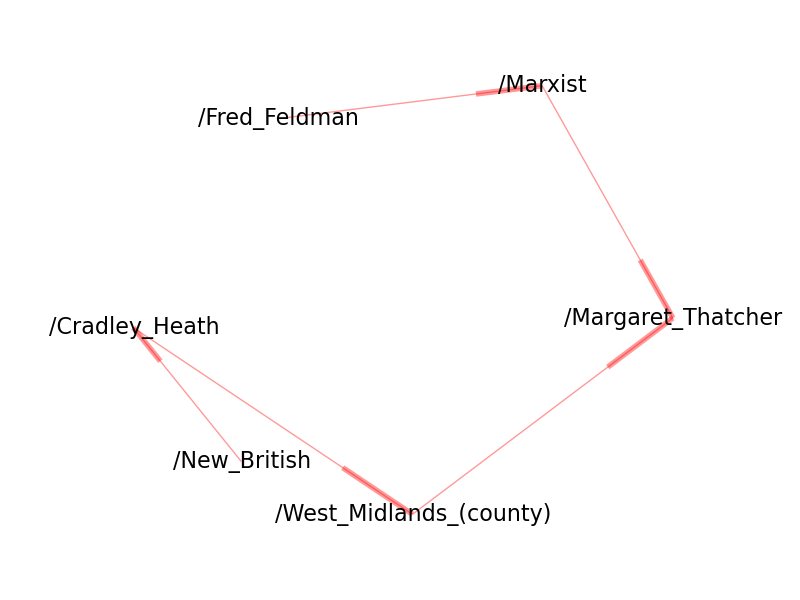
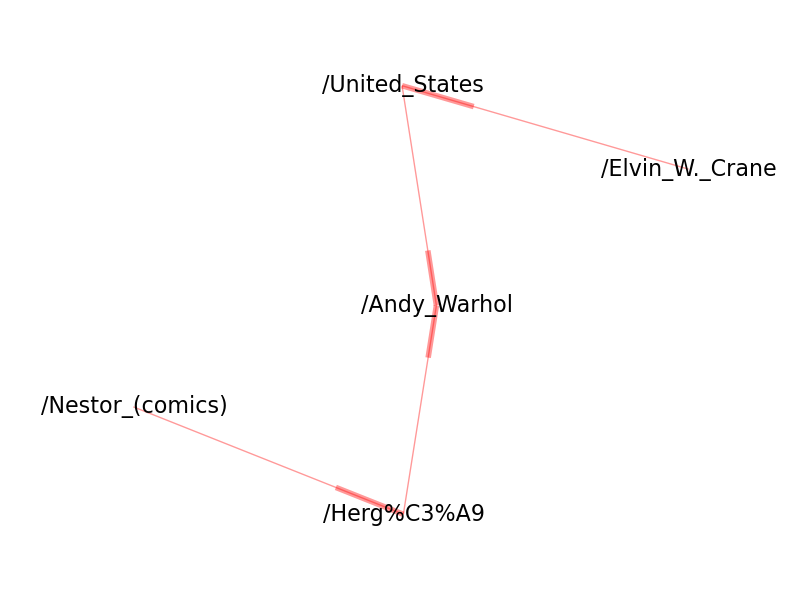
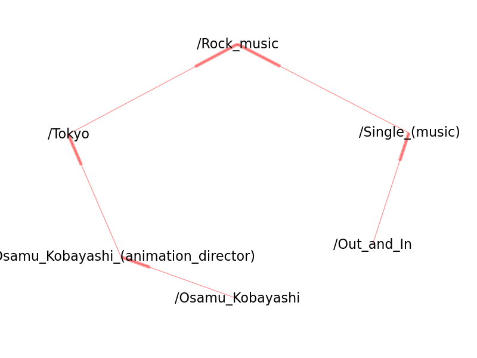

### Bidirectional search on Wikipedia articles ###

Last year for our AI class, one of the assignments we were given was to solve the 15-puzzle. This can be done using a basic breadth-first search, generating successors for the puzzle states in your tree until you get to the goal state. For our assignment though we had to do this using [bidirectional search](http://en.wikipedia.org/wiki/Bidirectional_search), which is just expanding the tree from the goal state and expanding the tree from the starting state, and when both trees intersect in some way (i.e. both sides share a common node) then you have found a path from the initial state to the goal state.

Anyway, last night I had a thought, what would it look like if I did this for Wikipedia? Given a starting link, and an ending link, can we find a path that connects them together (via visiting other Wikipedia links)?

It turns out I made a horrible assumption, and that was that links between two articles were undirected - i.e. if article 1 links to article 2, then article 2 also links to article 1! But that is very incorrect (for the 15-puzzle however this assumption is correct). I decided to do the bidirectional search anyway, and at some point I thought it would be cool to generate some graphs on this as well. So what I do is make use of Wikipedia's random article feature, and generate two random article links - one for the left side of the bidirectional search, and one for the right side. Then let them find each other!



So for this one, the two random articles that started the search were **Fred Feldman** and **New British**. You can see that from the page **New British**, we can get to **Cradley Heath**, and then to **West Midlands**, and then finally we can get to **Margaret Thatcher**. Obviously this is indicated by the direction of the arrows in the graph. We can also look at the graph in the other direction - from **Fred Feldman** and then to **Marxist** we can to **Margaret Thatcher**.

However, we can't get from **Margaret Thatcher** to **West Midlands**. Even if it were possible, you wouldn't see a directed edge going from Thatcher to Midlands, because of the nature of the bidirectional search.

But we can see that from both sides of the bidirectional search are connected by the **Margaret Thatcher** article. For this discussion, I will refer to a node like this as the "central node".

Let's look at some other graphs.



We can see here that the central node is **Andy Warhol**.



*Rock music* for this one.

If we do this for lots of graphs, perhaps not surprisingly, the central node is something that's quite common, like a well-known place or country.

```
http://en.wikipedia.org/wiki/Gini_coefficient
http://en.wikipedia.org/wiki/Lung_cancer
http://en.wikipedia.org/wiki/Chromista
http://en.wikipedia.org/wiki/U2
http://en.wikipedia.org/wiki/Latin
http://en.wikipedia.org/wiki/Andy_Warhol
http://en.wikipedia.org/wiki/United_States
http://en.wikipedia.org/wiki/Rock_music
http://en.wikipedia.org/wiki/Henry_David_Thoreau
http://en.wikipedia.org/wiki/Germany
http://en.wikipedia.org/wiki/Climate
http://en.wikipedia.org/wiki/American_football
http://en.wikipedia.org/wiki/UNESCO
http://en.wikipedia.org/wiki/Latitude
http://en.wikipedia.org/wiki/Canada
http://en.wikipedia.org/wiki/Los_Angeles
http://en.wikipedia.org/wiki/Baseball
http://en.wikipedia.org/wiki/Thailand
http://en.wikipedia.org/wiki/Member_of_Parliament
http://en.wikipedia.org/wiki/De_jure
http://en.wikipedia.org/wiki/Madrid
http://en.wikipedia.org/wiki/Mexico
http://en.wikipedia.org/wiki/Ptolemy
http://en.wikipedia.org/wiki/Argentina
http://en.wikipedia.org/wiki/The_Jam
http://en.wikipedia.org/wiki/France
http://en.wikipedia.org/wiki/French_language
http://en.wikipedia.org/wiki/Roman_numerals
http://en.wikipedia.org/wiki/Carl_Linnaeus
http://en.wikipedia.org/wiki/New_York_City
http://en.wikipedia.org/wiki/England
http://en.wikipedia.org/wiki/Record_label
http://en.wikipedia.org/wiki/Aristotle
http://en.wikipedia.org/wiki/Romanian_language
http://en.wikipedia.org/wiki/The_Football_Association
http://en.wikipedia.org/wiki/Binomial_nomenclature
http://en.wikipedia.org/wiki/Music_genre
http://en.wikipedia.org/wiki/Netherlands
http://en.wikipedia.org/wiki/East_Germany
http://en.wikipedia.org/wiki/India
http://en.wikipedia.org/wiki/Telephone_numbering_plan
http://en.wikipedia.org/wiki/Nepal
http://en.wikipedia.org/wiki/PubMed_Central
http://en.wikipedia.org/wiki/Margaret_Thatcher
http://en.wikipedia.org/wiki/John_Cage
http://en.wikipedia.org/wiki/Malaria
http://en.wikipedia.org/wiki/List_of_sovereign_states
http://en.wikipedia.org/wiki/Subsidiary
http://en.wikipedia.org/wiki/Financial_Times
http://en.wikipedia.org/wiki/Williamsport,_Pennsylvania
http://en.wikipedia.org/wiki/Australia
http://en.wikipedia.org/wiki/Sunlight
http://en.wikipedia.org/wiki/Daylight_saving_time
http://en.wikipedia.org/wiki/Middle_Ages
http://en.wikipedia.org/wiki/William_Shakespeare
http://en.wikipedia.org/wiki/Tower_of_London
http://en.wikipedia.org/wiki/Evolution
http://en.wikipedia.org/wiki/Mesoamerica
http://en.wikipedia.org/wiki/USA
http://en.wikipedia.org/wiki/Federal_Republic_of_Yugoslavia
http://en.wikipedia.org/wiki/Egypt
http://en.wikipedia.org/wiki/Don_DeLillo
http://en.wikipedia.org/wiki/Overseas_Chinese
http://en.wikipedia.org/wiki/University_of_California
http://en.wikipedia.org/wiki/Convergent_evolution
http://en.wikipedia.org/wiki/Belgium
http://en.wikipedia.org/wiki/European_Union
http://en.wikipedia.org/wiki/Computer
http://en.wikipedia.org/wiki/Virginia
http://en.wikipedia.org/wiki/International_Standard_Book_Number
http://en.wikipedia.org/wiki/The_New_York_Times
http://en.wikipedia.org/wiki/BBC
http://en.wikipedia.org/wiki/United_States_dollar
http://en.wikipedia.org/wiki/Turkey
http://en.wikipedia.org/wiki/Robert_Hooke
http://en.wikipedia.org/wiki/Finland
http://en.wikipedia.org/wiki/Indiana
http://en.wikipedia.org/wiki/Atlantic_Ocean
http://en.wikipedia.org/wiki/Borough
http://en.wikipedia.org/wiki/South_Korea
http://en.wikipedia.org/wiki/Turkish_language
http://en.wikipedia.org/wiki/City_proper
http://en.wikipedia.org/wiki/World_War_II
http://en.wikipedia.org/wiki/Philippines
http://en.wikipedia.org/wiki/Folk_music
http://en.wikipedia.org/wiki/World_War_I
http://en.wikipedia.org/wiki/Korea
http://en.wikipedia.org/wiki/Hong_Kong_International_Airport
http://en.wikipedia.org/wiki/Russia
http://en.wikipedia.org/wiki/Massachusetts
http://en.wikipedia.org/wiki/United_Kingdom
```

We can also briefly analyze how many nodes are in each graph.

```{r}
df = read.csv("R/node-hist.txt",header=TRUE)
# print number of entries
nrow(df)-1
```

```{r}
# summary statistics
summary(df$nodes)
```

```{r}
hist(df$nodes,breaks=4)
```

So a large majority of these graphs comprise of only 5-6 nodes, probably due to our central nodes being articles like the **United States** or **World War II**. And as a result of this, when we use bidirectional search to connect two random articles we don't end up with massive graphs. This probably would not be the case with a uni-directional search, however. It would probably be more interesting that way, too. :)